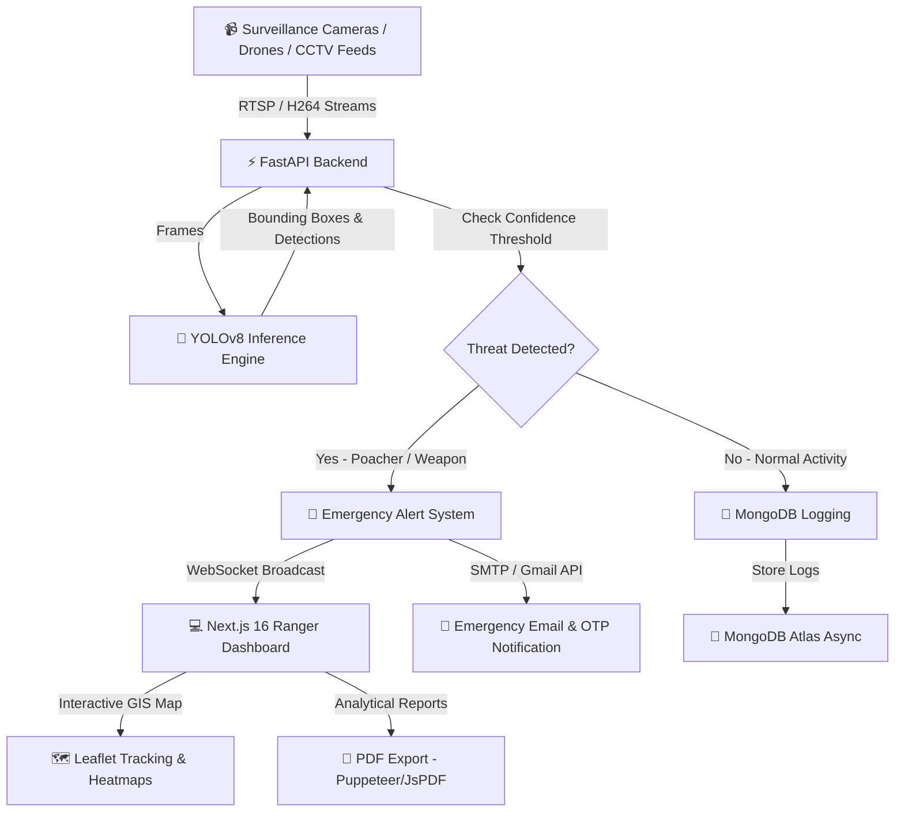

<div align="center">

  # 🌲 THE SAVIOUR 🛡️
  ### Next-Gen AI-Powered Wildlife Surveillance & Poaching Prevention Platform

  [](https://nextjs.org/)
  [](https://react.dev/)
  [](https://tailwindcss.com/)
  [](https://fastapi.tiangolo.com/)
  [](https://www.python.org/)
  [](https://docs.ultralytics.com/)
  [](https://pytorch.org/)
  [](https://www.mongodb.com/)
  [](https://firebase.google.com/)
  [](LICENSE)

  <p align="center">
    <b>Empowering Forest Officers & Wildlife Conservators with Real-Time AI Computer Vision, Threat Alerts, and Emergency Response Management.</b>
  </p>

  ---

</div>

## 📌 Executive Summary

**THE SAVIOUR** is an enterprise-grade, mission-critical AI platform designed to protect endangered wildlife species from poaching, human intrusion, and habitat encroachment. Powered by state-of-the-art **YOLOv8 object detection**, high-speed **FastAPI WebSockets**, and an intuitive **Next.js 16 dashboard**, THE SAVIOUR converts raw surveillance feeds into actionable intelligence—instantly alerting forest rangers before casualties occur.

---

## 👥 Team Members & Workflow Roles

| Contributor | Primary Role | Core Workflow & Responsibilities |
| :--- | :--- | :--- |
| **Parth** | **Backend Lead & Core Architect** | • Developed the complete **FastAPI (Python 3.12)** backend services.<br>• Designed **MongoDB Atlas (Motor Async)** schemas & database management.<br>• Implemented real-time **WebSocket streaming engine** for live threat alerts.<br>• Engineered **JWT authentication & Gmail OTP verification** pipelines. |
| **Asfaq** | **Frontend Lead & System Testing** | • Engineered the **Next.js 16 (App Router)** UI & **Tailwind CSS v4** styling.<br>• Integrated **Leaflet GIS Map** and **Recharts analytics** components.<br>• Ensured **100% Mobile & Desktop responsiveness** across all views.<br>• Conducted comprehensive end-to-end system testing & bug fixes. |
| **Sami** | **AI / ML Data Engineer** | • Curated and annotated dataset images for poachers, weapons, & wildlife.<br>• Trained custom **YOLOv8 deep learning models** on **Google Colab GPUs**.<br>• Fine-tuned confidence scores, bounding box parameters, and detection accuracy.<br>• Exported & optimized model weights (`best.pt`) for backend integration. |

---

## ✨ Key Features

- 🤖 **AI-Powered Real-Time Threat Detection**:
  - Detects **poachers, weapons (firearms/knives), unauthorized vehicles, and protected wildlife** (Tigers, Elephants, Rhinos, etc.) in live video streams.
  - High confidence bounding boxes processed frame-by-frame via PyTorch and OpenCV.

- ⚡ **Ultra-Low Latency Live Feed & WebSockets**:
  - Live CCTV / Thermal Camera / Drone feed streaming with direct WebSocket push updates to the dashboard.
  - Interactive camera selector with status monitoring (Online, Maintenance, Alert Active).

- 🗺️ **GIS Interactive Surveillance Map**:
  - Integrated **Leaflet GIS Map** showing live camera locations, active threat nodes, patrol team locations, and high-risk zones.
  - Real-time marker updates and popup incident summary cards.

- 🚨 **Instant SOS & Emergency Alert Dispatch**:
  - Multi-channel notification engine triggering dashboard popups, SMS, and **Gmail SMTP OTP / Email notifications** upon detecting critical threats.
  - Severity classification (Critical, Warning, Info) with rapid dispatch buttons for quick ranger deployment.

- 📊 **Advanced Analytics & Heatmaps**:
  - Comprehensive analytical suite built with **Recharts**.
  - Animal movement tracking, hourly threat distribution, intrusion heatmaps, and camera health metrics.

- 📄 **Automated PDF Incident Logging & Export**:
  - One-click report generation for legal documentation and government compliance.
  - High-resolution HTML-to-PDF compilation via **Puppeteer**, **JsPDF**, and **Html2Canvas**.

- 🔐 **Role-Based Authentication & Security**:
  - Enterprise JWT authentication backed by **Bcrypt** password hashing and **Gmail OTP verification**.
  - Secondary authentication integration via **Firebase Auth**.

- 🔄 **Cloud-Native AI Training Workflow**:
  - Seamless pipeline for training custom YOLO models on **Google Colab GPUs (T4/A100)** and deploying exported `best.pt` model weights directly into the FastAPI inference engine.

---

## 🛠️ Technology Stack

### **Frontend Architecture**
| Technology | Description |
| :--- | :--- |
| **Next.js 16 (App Router)** | Full-stack React framework optimized for speed, SSR, and API routes |
| **React 19** | Modern UI rendering library with concurrent features |
| **TypeScript** | Type-safe development environment |
| **Tailwind CSS v4** | Next-generation utility-first CSS styling engine |
| **Framer Motion** | Micro-interactions and fluid animation transitions |
| **Leaflet & React-Leaflet** | Interactive vector mapping & GIS location rendering |
| **Recharts** | Interactive charting engine for analytics and metrics |
| **Lucide Icons** | Modern UI icon library |

### **Backend Architecture**
| Technology | Description |
| :--- | :--- |
| **FastAPI** | Asynchronous Python web framework for high-performance APIs |
| **Uvicorn** | Lightning-fast ASGI web server |
| **PyTorch** | Deep learning platform powering model inference |
| **Ultralytics YOLOv8** | State-of-the-art computer vision model for real-time detection |
| **OpenCV (cv2)** | Image and video stream processing |
| **Motor (MongoDB Async)** | Asynchronous Python driver for MongoDB Atlas |
| **WebSockets** | Bi-directional real-time alert and telemetry stream |
| **Pydantic v2** | Data validation and settings management |

### **Security, Services & Reporting**
| Technology | Description |
| :--- | :--- |
| **JWT & Passlib** | Secure authentication and password hashing |
| **Firebase Auth** | User identity management |
| **Nodemailer / Smtplib** | Automated email dispatch & OTP verification |
| **Puppeteer & JsPDF** | Headless PDF generation for incident logs |

---

## 📐 System Architecture



---

## 📁 Directory Structure

```text
The-Saviour/
├── the-saviour/               # Next.js 16 Frontend & Core Application
│   ├── backend/               # FastAPI Asynchronous AI Backend
│   │   ├── models/            # YOLOv8 Trained Weights (best.pt)
│   │   ├── main.py            # FastAPI Entry Point, Routes & WebSockets
│   │   ├── check_model.py     # Model verification script
│   │   ├── database_schema.md # MongoDB schema specification
│   │   └── requirements.txt   # Python Dependencies
│   ├── src/
│   │   ├── app/               # Next.js App Router Pages
│   │   │   ├── page.tsx       # Landing Page & Overview
│   │   │   ├── dashboard/    # Main Ranger Command Center
│   │   │   ├── cctv/         # Live Feed & Camera Management
│   │   │   ├── alerts/       # Real-Time Intrusion Alerts
│   │   │   ├── analytics/    # Recharts Incident Analytics
│   │   │   ├── database/     # Detection Logs & History
│   │   │   └── login/        # Authentication Portal
│   │   ├── components/        # Reusable UI & Layout Components
│   │   ├── lib/              # Firebase, MongoDB, & Utility Helpers
│   │   └── config/           # Site & App Configurations
│   ├── public/                # Static Assets & Icons
│   ├── package.json           # Node Dependencies & Scripts
│   ├── tailwind.config.ts     # Tailwind CSS Settings
│   ├── ARCHITECTURE.md        # Deep-dive System Architecture Docs
│   └── README.md              # Project Documentation
├── runs/                      # Local YOLO Model Training Output Runs
└── videos/                    # Sample Surveillance Video Streams for Testing
```

---

## 🚀 Quick Start & Installation

### 📋 Prerequisites
- **Node.js**: `v20.0.0` or higher
- **Python**: `v3.10` or higher
- **MongoDB**: Local instance or MongoDB Atlas URI
- **Git**: Installed on system

---

### 1️⃣ Clone the Repository
```bash
git clone https://github.com/Parthh1002/The-Saviourr.git
cd The-Saviourr/the-saviour
```

---

### 2️⃣ Backend Setup (FastAPI + YOLOv8)

```bash
# Navigate to backend directory
cd backend

# Create virtual environment
python -m venv venv

# Activate virtual environment
# Windows (PowerShell):
.\venv\Scripts\Activate.ps1
# macOS/Linux:
source venv/bin/activate

# Install backend dependencies
pip install -r requirements.txt

# Start FastAPI server
uvicorn main:app --reload --host 0.0.0.0 --port 8000
```
> ℹ️ The backend server will start at `http://localhost:8000`. You can test APIs at `http://localhost:8000/docs`.

---

### 3️⃣ Frontend Setup (Next.js 16)

Open a new terminal tab and navigate to `the-saviour`:

```bash
cd the-saviour

# Install dependencies
npm install

# Configure Environment Variables
cp .env.example .env.local  # (Or create .env.local file)

# Run development server
npm run dev
```

> 🌐 Open your browser and navigate to `http://localhost:3000`.

---

## ⚙️ Environment Variables

Create a `.env` / `.env.local` file inside `the-saviour/` and configure the following:

```env
# Frontend Environment
NEXT_PUBLIC_API_URL=http://localhost:8000
NEXT_PUBLIC_WS_URL=ws://localhost:8000/ws/live-feed

# Firebase Credentials
NEXT_PUBLIC_FIREBASE_API_KEY=your_firebase_api_key
NEXT_PUBLIC_FIREBASE_AUTH_DOMAIN=your_project.firebaseapp.com
NEXT_PUBLIC_FIREBASE_PROJECT_ID=your_project_id

# Backend Environment (backend/.env or exported)
MONGO_URI=mongodb://localhost:27017/saviour_db
SECRET_KEY=your_super_secret_jwt_key_change_in_production
GMAIL_USER=your_email@gmail.com
GMAIL_APP_PASS=your_gmail_app_password
```

---

## 📡 API Endpoints Overview

| Method | Endpoint | Description |
| :--- | :--- | :--- |
| `POST` | `/api/v1/auth/signup` | User Registration & OTP Dispatch |
| `POST` | `/api/v1/auth/verify-otp` | Verify Gmail OTP & Create Account |
| `POST` | `/api/v1/auth/login` | Authenticate user & return JWT Token |
| `POST` | `/api/v1/analyze/image` | Run YOLOv8 detection on uploaded image |
| `POST` | `/api/v1/analyze/video` | Process video stream chunk for threats |
| `GET` | `/api/v1/alerts/critical` | Fetch all active critical intrusion alerts |
| `WS` | `/ws/live-feed/{camera_id}` | WebSocket stream for real-time bounding boxes |

---

## 🎯 Model Training & Custom Weights Workflow

1. **Dataset Structuring**: Annotate surveillance images (poachers, firearms, animals) in standard YOLO format.
2. **Train on Google Colab**:
   ```python
   from ultralytics import YOLO

   # Load YOLOv8 pretrained model
   model = YOLO('yolov8s.pt')

   # Train model on GPU
   model.train(data='custom_dataset.yaml', epochs=100, imgsz=640)
   ```
3. **Export Weights**: Download the resulting `best.pt` file.
4. **Deploy Model**: Save `best.pt` into `the-saviour/backend/models/best.pt`. The backend will automatically detect and load your trained model on startup!

---

## 🤝 Contributing

Contributions make the open-source community an inspiring place to learn, design, and create. Any contributions to **THE SAVIOUR** are greatly appreciated!

1. Fork the Project
2. Create your Feature Branch (`git checkout -b feature/AmazingFeature`)
3. Commit your Changes (`git commit -m 'Add some AmazingFeature'`)
4. Push to the Branch (`git checkout -b feature/AmazingFeature`)
5. Open a Pull Request

---

## 📄 License

Distributed under the **MIT License**. See `LICENSE` for more information.

<div align="center">

  ---
  Made with ❤️ & 🌿 by **Team Saviour** to protect wildlife and empower conservators worldwide.

</div>
