Bhai, ye lo **poora combined, ultra-premium, animated aur fadu README.md**! Isme aapka team table, live Vercel link, GitHub repo link, YouTube video banner, typing animation aur official tech icons sab add kar diya hai:

---

```markdown
<div align="center">

  <!-- Animated Header Banner -->
  <a href="https://the-saviour.vercel.app">
    
  </a>

  <br/>

  <!-- Dynamic Typing SVG -->
  <a href="https://git.io/typing-svg">
    
  </a>

  <br/>

  <!-- Status & Metric Badges -->
  <p align="center">
    <a href="https://the-saviour.vercel.app"></a>
    <a href="https://github.com/Parthh1002/The-Saviourr"></a>
    <a href="https://youtu.be/bVBt6yWTc9w?si=9P6ibrOTQY2v_nv_"></a>
    
  </p>

  <!-- Quick Links Navigation -->
  <p align="center">
    <a href="#-executive-summary"><b>Executive Summary</b></a> •
    <a href="#-project-video-walkthrough"><b>Video Demo</b></a> •
    <a href="#-team-members--workflow-architecture"><b>Team & Roles</b></a> •
    <a href="#-key-features"><b>Features</b></a> •
    <a href="#-technology-stack"><b>Tech Stack</b></a> •
    <a href="#-system-architecture"><b>Architecture</b></a> •
    <a href="#-quick-start--installation"><b>Installation</b></a>
  </p>

</div>

---

## 📌 Executive Summary

> **"Watching every leaf, every footprint — so the wild stays wild."**

**THE SAVIOUR** is an enterprise-grade, mission-critical AI platform designed to protect endangered wildlife species from poaching, human intrusion, and habitat encroachment. Powered by state-of-the-art **YOLOv8 custom object detection**, high-speed **FastAPI WebSockets**, and an intuitive **Next.js 16 dashboard**, THE SAVIOUR converts raw surveillance feeds into actionable intelligence — instantly alerting forest rangers with precise GPS coordinates before casualties occur.

---

## 🌐 Live Website & Links

| Resource | URL Link | Status |
| :--- | :--- | :--- |
| 🚀 **Live Web Platform** | [https://the-saviour.vercel.app](https://the-saviour.vercel.app) | 🟢 Active & Deployed |
| 📁 **GitHub Repository** | [https://github.com/Parthh1002/The-Saviourr](https://github.com/Parthh1002/The-Saviourr) | 🟢 Public Repository |
| 🎬 **YouTube Overview Video** | [https://youtu.be/bVBt6yWTc9w](https://youtu.be/bVBt6yWTc9w?si=9P6ibrOTQY2v_nv_) | 🟢 Live Demonstration |
| ⚡ **FastAPI Swagger API Docs** | [http://localhost:8000/docs](http://localhost:8000/docs) | 🟢 Local / Server Endpoint |

---

## 🎬 Project Video Walkthrough

<div align="center">
  <a href="https://youtu.be/bVBt6yWTc9w?si=9P6ibrOTQY2v_nv_">
    
  </a>
  <p><i>▶ Click above to watch the full project overview & live demonstration on YouTube.</i></p>
</div>

---

## 👥 Team Members & Workflow Architecture

| Member | Primary Role | Domain & Task Workflow |
| :--- | :--- | :--- |
| **Parth** | **Backend Lead & Core Architect** | • **Full Backend Engine**: Developed complete FastAPI (Python 3.12) server.<br>• **Database & Schema**: Implemented MongoDB Atlas (Motor Async Engine) for real-time detection logging.<br>• **Real-Time Telemetry**: Built WebSocket streaming pipeline (`/ws/live-feed`) for instant alert push.<br>• **Security & Auth**: Engineered JWT token authentication, Bcrypt password hashing, & Gmail SMTP OTP dispatch. |
| **Asfaq** | **Frontend Lead & System Testing** | • **User Interface**: Designed & built full Next.js 16 (App Router) & Tailwind CSS v4 dashboard.<br>• **GIS & Analytics**: Integrated Leaflet interactive map nodes & Recharts live performance charts.<br>• **Mobile Optimization**: Made the entire web app 100% responsive across phones, tablets, & desktops.<br>• **Quality Assurance**: Conducted end-to-end integration testing, UI bug fixes, & automated PDF report generation. |
| **Sami** | **AI / ML Data Scientist** | • **Dataset Preparation**: Collected and annotated custom dataset images for poachers, firearms, tigers, elephants, & vehicles.<br>• **Model Training**: Trained YOLOv8 object detection model on Google Colab GPUs (T4/A100).<br>• **Hyperparameter Tuning**: Optimized confidence thresholds, bounding box predictions, & frame rates.<br>• **Model Deployment**: Exported `best.pt` weights and linked inference pipeline into OpenCV/PyTorch backend. |

---

## ✨ Key Features

<table>
  <tr>
    <td width="50%">
      <h3>🤖 AI Threat Detection (YOLOv8)</h3>
      <ul>
        <li>Detects <b>poachers, weapons (firearms/knives), unauthorized vehicles, and protected wildlife</b> in live video feeds.</li>
        <li>High-confidence bounding box inference processed frame-by-frame via PyTorch and OpenCV.</li>
      </ul>
    </td>
    <td width="50%">
      <h3>⚡ Ultra-Low Latency WebSockets</h3>
      <ul>
        <li>Live CCTV / Thermal / Drone stream processing with WebSocket push straight to the ranger dashboard.</li>
        <li>Interactive multi-camera selector with status monitoring (Online, Maintenance, Alert Active).</li>
      </ul>
    </td>
  </tr>
  <tr>
    <td width="50%">
      <h3>🗺️ GIS Interactive Surveillance Map</h3>
      <ul>
        <li>Integrated <b>Leaflet GIS Map</b> showing live camera positions, active threat nodes, and patrol teams.</li>
        <li>Live marker updates, sector risk scoring, and popup incident summary cards.</li>
      </ul>
    </td>
    <td width="50%">
      <h3>🚨 Rapid SOS & Multi-Channel Alerts</h3>
      <ul>
        <li>Multi-channel alert dispatch triggering UI modals, SMS, and <b>Gmail SMTP / OTP notifications</b>.</li>
        <li>Severity classification (Critical, Warning, Info) with rapid dispatch buttons for ranger deployment.</li>
      </ul>
    </td>
  </tr>
  <tr>
    <td width="50%">
      <h3>📊 Incident Analytics & Heatmaps</h3>
      <ul>
        <li>Comprehensive telemetry suite built with <b>Recharts</b>.</li>
        <li>Animal movement tracking, hourly threat distribution, intrusion heatmaps, and camera health metrics.</li>
      </ul>
    </td>
    <td width="50%">
      <h3>📄 Automated PDF Incident Dossiers</h3>
      <ul>
        <li>One-click incident reports for legal documentation and forest department compliance.</li>
        <li>Compiled client-side with <b>JsPDF</b>, <b>Html2Canvas</b>, and headless <b>Puppeteer</b>.</li>
      </ul>
    </td>
  </tr>
</table>

---

## 🛠️ Technology Stack

<div align="center">

### 💻 Frontend & UI/UX
<p align="center">
  
</p>

```
Next.js 16 (App Router) • React 19 • TypeScript • Tailwind CSS v4 • Framer Motion • Leaflet GIS • Recharts • Lucide Icons
```

### 🧠 AI / Computer Vision & Backend
<p align="center">
  
</p>

```
FastAPI • Python 3.12+ • Ultralytics YOLOv8 • PyTorch • OpenCV • Motor (Async MongoDB) • WebSockets • Firebase Auth
```

### 🛡️ Security, Communication & Reporting
<p align="center">
  
  
  
  
</p>

</div>

---

## 📐 System Architecture

```mermaid
flowchart TD
    subgraph Feeds ["🌲 Surveillance Edge & Feeds"]
        CAM["📹 Trail / CCTV / Thermal Cameras"]
        DRN["🛸 Drone Aerial Stream"]
    end

    subgraph Backend ["⚡ FastAPI Backend & AI Pipeline"]
        WS["🔌 WebSocket Server (/ws/live-feed)"]
        YOLO["🧠 YOLOv8 Inference Engine (best.pt)"]
        CHECK{"Threat Detected?"}
        CAM --> WS
        DRN --> WS
        WS --> YOLO
        YOLO --> CHECK
    end

    subgraph Storage ["🍃 Database & Cloud"]
        MONGO[("🍃 MongoDB Atlas Async Logs")]
        FIRE["🔥 Firebase Auth & Identity"]
    end

    subgraph Alerts ["🚨 Dispatch Engine"]
        MAIL["📧 Gmail SMTP / OTP Emergency Dispatch"]
        ALERT["🚨 Priority Event Trigger"]
    end

    subgraph Frontend ["💻 Ranger Command Center (Next.js 16)"]
        DASH["🌐 Command Dashboard"]
        MAP["🗺️ Interactive Leaflet GIS"]
        CHARTS["📊 Recharts Telemetry"]
        PDF["📄 PDF Incident Export"]
    end

    CHECK -->|Yes: Poacher / Weapon / Intruder| ALERT
    CHECK -->|No: Normal Wildlife Activity| MONGO
    ALERT --> MAIL
    ALERT --> WS
    WS --> DASH
    DASH --> MAP
    DASH --> CHARTS
    DASH --> PDF
    FIRE -.-> DASH
    MONGO -.-> DASH
```



---

## 📁 Repository Structure

```text
The-Saviour/
├── the-saviour/               # Next.js 16 Frontend & Core Application
│   ├── backend/               # FastAPI Asynchronous AI Backend
│   │   ├── models/            # YOLOv8 Trained Weights (best.pt)
│   │   ├── main.py            # FastAPI Entry Point, Routes & WebSockets
│   │   ├── check_model.py     # Model verification script
│   │   ├── database_schema.md # MongoDB schema specification
│   │   └── requirements.txt   # Python Dependencies
│   ├── src/
│   │   ├── app/               # Next.js App Router Pages
│   │   │   ├── page.tsx       # Landing Page & Overview
│   │   │   ├── dashboard/    # Main Ranger Command Center
│   │   │   ├── cctv/         # Live Feed & Camera Management
│   │   │   ├── alerts/       # Real-Time Intrusion Alerts
│   │   │   ├── analytics/    # Recharts Incident Analytics
│   │   │   ├── database/     # Detection Logs & History
│   │   │   └── login/        # Authentication Portal
│   │   ├── components/        # Reusable UI & Layout Components
│   │   ├── lib/              # Firebase, MongoDB, & Utility Helpers
│   │   └── config/           # Site & App Configurations
│   ├── public/                # Static Assets & Icons
│   ├── package.json           # Node Dependencies & Scripts
│   ├── tailwind.config.ts     # Tailwind CSS Settings
│   ├── ARCHITECTURE.md        # Deep-dive System Architecture Docs
│   └── README.md              # Project Documentation
├── runs/                      # Local YOLO Model Training Output Runs
└── videos/                    # Sample Surveillance Video Streams for Testing
```

---

## 🚀 Quick Start & Installation

### 📋 Prerequisites
- **Node.js**: `v20.0.0` or higher
- **Python**: `v3.10` or higher
- **MongoDB**: Local instance or MongoDB Atlas URI
- **Git**: Installed on system

---

### 1️⃣ Clone the Repository
```bash
git clone https://github.com/Parthh1002/The-Saviourr.git
cd The-Saviourr/the-saviour
```

---

### 2️⃣ Backend Setup (FastAPI + YOLOv8)

```bash
# Navigate to backend directory
cd backend

# Create virtual environment
python -m venv venv

# Activate virtual environment
# Windows (PowerShell):
.\venv\Scripts\Activate.ps1
# macOS/Linux:
source venv/bin/activate

# Install backend dependencies
pip install -r requirements.txt

# Start FastAPI server
uvicorn main:app --reload --host 0.0.0.0 --port 8000
```
> ℹ️ The backend server will start at `http://localhost:8000`. You can test APIs at `http://localhost:8000/docs`.

---

### 3️⃣ Frontend Setup (Next.js 16)

Open a new terminal tab and navigate to `the-saviour`:

```bash
cd the-saviour

# Install dependencies
npm install

# Configure Environment Variables
cp .env.example .env.local  # (Or create .env.local file)

# Run development server
npm run dev
```

> 🌐 Open your browser and navigate to `http://localhost:3000`.

---

## ⚙️ Environment Variables

Create a `.env.local` file inside `the-saviour/`:

```env
# Frontend Environment
NEXT_PUBLIC_API_URL=http://localhost:8000
NEXT_PUBLIC_WS_URL=ws://localhost:8000/ws/live-feed

# Firebase Credentials
NEXT_PUBLIC_FIREBASE_API_KEY=your_firebase_api_key
NEXT_PUBLIC_FIREBASE_AUTH_DOMAIN=your_project.firebaseapp.com
NEXT_PUBLIC_FIREBASE_PROJECT_ID=your_project_id

# Backend Environment (backend/.env)
MONGO_URI=mongodb://localhost:27017/saviour_db
SECRET_KEY=your_super_secret_jwt_key_change_in_production
GMAIL_USER=your_email@gmail.com
GMAIL_APP_PASS=your_gmail_app_password
```

---

## 📡 API Endpoints Overview

| Method | Endpoint | Description |
| :--- | :--- | :--- |
| `POST` | `/api/v1/auth/signup` | User Registration & OTP Dispatch |
| `POST` | `/api/v1/auth/verify-otp` | Verify Gmail OTP & Create Account |
| `POST` | `/api/v1/auth/login` | Authenticate user & return JWT Token |
| `POST` | `/api/v1/analyze/image` | Run YOLOv8 detection on uploaded image |
| `POST` | `/api/v1/analyze/video` | Process video stream chunk for threats |
| `GET` | `/api/v1/alerts/critical` | Fetch all active critical intrusion alerts |
| `WS` | `/ws/live-feed/{camera_id}` | WebSocket stream for real-time bounding boxes |

---

## 🎯 Model Training & Custom Weights Workflow

1. **Dataset Structuring**: Annotate surveillance images (poachers, firearms, animals) in standard YOLO format.
2. **Train on Google Colab**:
   ```python
   from ultralytics import YOLO

   # Load YOLOv8 pretrained model
   model = YOLO('yolov8s.pt')

   # Train model on GPU
   model.train(data='custom_dataset.yaml', epochs=100, imgsz=640)
   ```
3. **Export Weights**: Download the resulting `best.pt` file.
4. **Deploy Model**: Save `best.pt` into `the-saviour/backend/models/best.pt`. The backend will automatically detect and load your trained model on startup!

---

## 🤝 Contributing

1. Fork the Project
2. Create your Feature Branch (`git checkout -b feature/AmazingFeature`)
3. Commit your Changes (`git commit -m 'Add some AmazingFeature'`)
4. Push to the Branch (`git push origin feature/AmazingFeature`)
5. Open a Pull Request

---

## 📄 License

Distributed under the **MIT License**. See `LICENSE` for more information.

<div align="center">
  <br/>
  <p>Made with ❤️ & 🌿 by <b>Team Saviour</b> to protect wildlife and empower conservators worldwide.</p>
  
</div>
```

---

