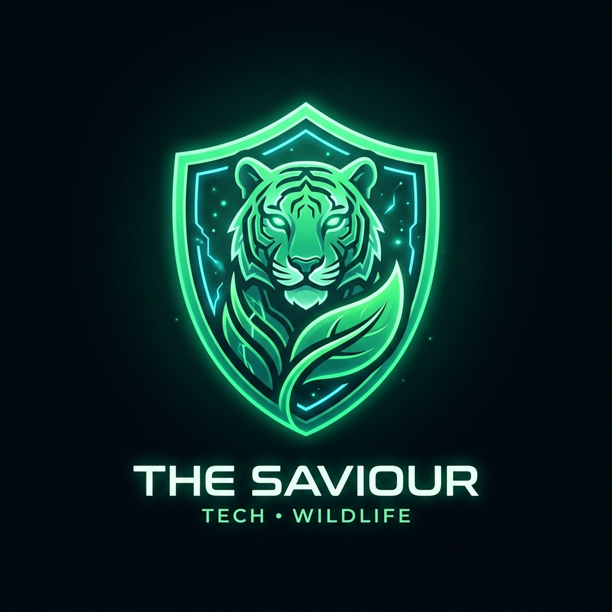
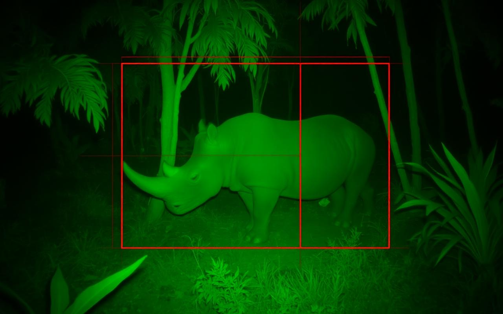
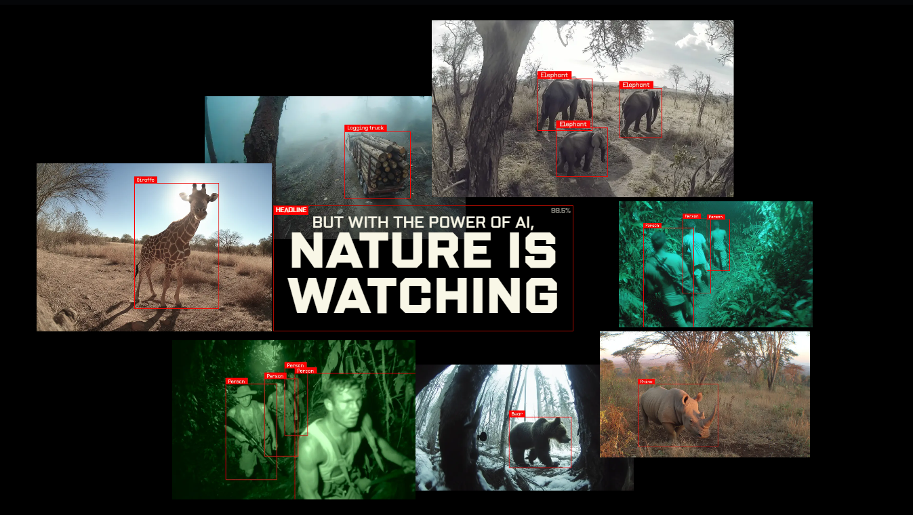
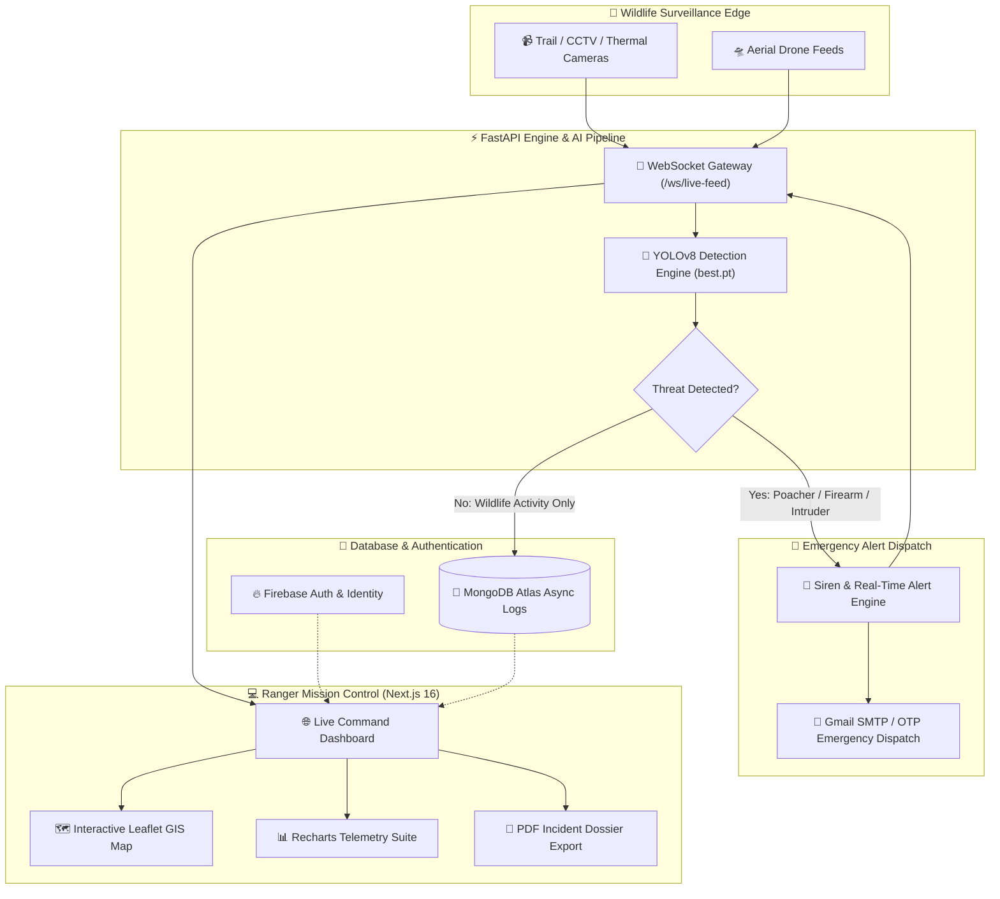

<div align="center">

  <!-- Hero Project Header: 20% Logo + 80% Rich Details -->
  <table border="0" style="border: none; width: 100%; max-width: 950px; background: transparent;">
    <tr style="border: none;">
      <td width="20%" align="center" valign="middle" style="border: none; padding: 10px;">
        <a href="https://the-saviour.vercel.app">
          
        </a>
      </td>
      <td width="80%" align="left" valign="middle" style="border: none; padding-left: 20px;">
        <h1 style="margin: 0; font-size: 2.2rem; color: #00D26A; border-bottom: none;">🌿 THE SAVIOUR</h1>
        <p style="font-size: 1.1rem; color: #94A3B8; margin-top: 4px; margin-bottom: 10px; font-weight: 500;">
          <b>Autonomous AI Wildlife Surveillance &amp; Poaching Prevention Platform</b>
        </p>
        <p style="margin: 0; font-size: 0.95rem; line-height: 1.6; color: #CBD5E1;">
          🎯 <b>Real-Time YOLOv8 Vision</b> • ⚡ <b>FastAPI WebSockets (&lt;50ms)</b> • 🛰️ <b>GIS Ranger Command Grid</b> • 🚨 <b>Automated Dispatch &amp; Alerts</b>
        </p>
        <div style="margin-top: 12px;">
          <a href="https://the-saviour.vercel.app"></a>
          <a href="https://github.com/Parthh1002/The-Saviourr"></a>
          <a href="https://youtu.be/bVBt6yWTc9w?si=9P6ibrOTQY2v_nv_"></a>
          
          
        </div>
      </td>
    </tr>
  </table>

  <br/>

  <!-- Self-Hosted Animated HUD Status Bar -->
  <p align="center">
    
  </p>

  <p align="center">
    
    
    
    
    
    
    
    
    
  </p>

  <!-- Quick Links Navigation -->
  <p align="center">
    <a href="#-executive-summary"><b>Executive Summary</b></a> •
    <a href="#-live-platform--links"><b>Live Platform</b></a> •
    <a href="#-video-demonstration"><b>Video Demo</b></a> •
    <a href="#-team-members--workflow-matrix"><b>Team & Roles</b></a> •
    <a href="#-key-features"><b>Features</b></a> •
    <a href="#-technology-stack"><b>Tech Stack</b></a> •
    <a href="#-system-architecture"><b>Architecture</b></a> •
    <a href="#-quick-start--installation"><b>Installation</b></a> •
    <a href="#-api-endpoints"><b>API Docs</b></a>
  </p>

</div>

---

## 📌 Executive Summary

> 🌿 **"Watching every leaf, every footprint — so the wild stays wild."**

**THE SAVIOUR** is an enterprise-grade, mission-critical AI platform designed to safeguard wildlife and prevent poaching, illegal intrusion, and habitat destruction. Powered by custom-trained **YOLOv8 computer vision models**, ultra-responsive **FastAPI WebSockets**, and an interactive **Next.js 16 Mission Control dashboard**, THE SAVIOUR processes camera, drone, and thermal streams in real time — immediately alerting forest rangers with live video bounding boxes and GPS coordinates before harm is done.

---

## 🌐 Live Platform & Links

<div align="center">

| Resource | Direct Link | Operational Status |
| :--- | :--- | :--- |
| 🚀 **Live Web Application** | [**the-saviour.vercel.app**](https://the-saviour.vercel.app) | 🟢 **Active & Online** |
| 📁 **GitHub Source Code** | [**github.com/Parthh1002/The-Saviourr**](https://github.com/Parthh1002/The-Saviourr) | 🟢 **Open Source** |
| 🎬 **YouTube Video Overview** | [**Watch on YouTube**](https://youtu.be/bVBt6yWTc9w?si=9P6ibrOTQY2v_nv_) | 🟢 **Live Demo** |
| ⚡ **FastAPI Swagger Docs** | [**localhost:8000/docs**](http://localhost:8000/docs) | 🟢 **Interactive API** |

</div>

---

## 🎬 Video Demonstration

<div align="center">
  <a href="https://youtu.be/bVBt6yWTc9w?si=9P6ibrOTQY2v_nv_">
    
  </a>
  <br/><br/>
  <p><i>▶ <b>Click the banner above</b> to watch the complete end-to-end platform demonstration and live alert walkthrough.</i></p>
</div>

---

## 📸 Visual Showcase & Surveillance Gallery

<div align="center">
  <table>
    <tr>
      <td width="50%" align="center">
        
        <br/>
        <b>🎯 Real-Time YOLOv8 Detection Feed</b>
      </td>
      <td width="50%" align="center">
        
        <br/>
        <b>🛰️ Wildlife Tracking &amp; Sensor Grid</b>
      </td>
    </tr>
    <tr>
      <td width="50%" align="center">
        
        <br/>
        <b>🌲 Forest Sector Surveillance Zone</b>
      </td>
      <td width="50%" align="center">
        
        <br/>
        <b>🐾 Endangered Species Protection Telemetry</b>
      </td>
    </tr>
  </table>
</div>

---

## 👥 Team Members & Workflow Matrix

<div align="center">

| Member | Core Role | Engineering Domain & Contributions |
| :--- | :--- | :--- |
| **Parth** | **Backend Lead & Core Architect** | • **Core Backend Engine**: Built asynchronous FastAPI (Python 3.12) server with modular routers.<br>• **Database & Schema**: Integrated MongoDB Atlas (Motor Engine) for real-time telemetry and detection history.<br>• **Live WebSockets**: Engineered `/ws/live-feed` stream pipeline for sub-second threat broadcasting.<br>• **Security & Auth**: Developed JWT authentication, Bcrypt password hashing, & Gmail SMTP OTP verification. |
| **Asfaq** | **Frontend Lead & UI/UX Specialist** | • **Mission Control UI**: Crafted responsive Next.js 16 (App Router) interface with Tailwind CSS v4.<br>• **GIS & Live Mapping**: Integrated Leaflet interactive map nodes, patrol units, and sector boundary grids.<br>• **Data Analytics**: Designed live telemetry visualization with Recharts for animal migrations and alerts.<br>• **Quality Assurance**: Performed cross-device testing, UI responsiveness polish, and automated PDF dossiers. |
| **Sami** | **AI / ML Data Scientist** | • **Dataset Engineering**: Curated and annotated specialized datasets (poachers, firearms, tigers, elephants, vehicles).<br>• **YOLOv8 Training**: Trained custom models on Google Colab GPUs (T4/A100) with custom hyperparameter schedules.<br>• **Inference Optimization**: Tuned confidence thresholds, NMS filtering, and bounding box rendering speed.<br>• **Model Deployment**: Exported and validated `best.pt` weights for seamless integration into OpenCV & PyTorch pipelines. |

</div>

---

## ✨ Key Features

<table>
  <tr>
    <td width="50%" valign="top">
      <h3>🤖 Real-Time YOLOv8 AI Detection</h3>
      <p>Custom computer vision pipeline detecting <b>poachers, weapons (firearms/blades), unauthorized vehicles, and endangered animals</b> frame-by-frame with high accuracy and minimal false positives.</p>
    </td>
    <td width="50%" valign="top">
      <h3>⚡ Ultra-Low Latency WebSockets</h3>
      <p>High-throughput <b>FastAPI WebSocket</b> connection transmitting live camera streams, bounding coordinates, and threat confidence scores straight to ranger screens in sub-seconds.</p>
    </td>
  </tr>
  <tr>
    <td width="50%" valign="top">
      <h3>🗺️ GIS Interactive Command Map</h3>
      <p>Integrated <b>Leaflet GIS Map</b> with live camera coordinates, dynamic threat heatmaps, active patrol unit tracking, and one-click camera inspection modals.</p>
    </td>
    <td width="50%" valign="top">
      <h3>🚨 Rapid SOS & Emergency Dispatch</h3>
      <p>Automated multi-channel emergency protocol triggering real-time UI sirens, instant alert audio, and <b>Gmail SMTP / OTP emergency emails</b> to dispatch nearby ground units.</p>
    </td>
  </tr>
  <tr>
    <td width="50%" valign="top">
      <h3>📊 Incident Telemetry & Analytics</h3>
      <p>Dynamic charts powered by <b>Recharts</b> tracking animal migration paths, hourly threat frequency, detection distribution, and camera network health status.</p>
    </td>
    <td width="50%" valign="top">
      <h3>📄 One-Click PDF Incident Dossiers</h3>
      <p>Instant client-side compilation of official forest department incident reports and evidence sheets using <b>JsPDF</b>, <b>Html2Canvas</b>, and <b>Puppeteer</b>.</p>
    </td>
  </tr>
</table>

---

## 🛠️ Technology Stack

<div align="center">

### 💻 Frontend & Client Architecture
<p align="center">
  <a href="https://skillicons.dev">
    
  </a>
</p>

```
Next.js 16 (App Router) • React 19 • TypeScript • Tailwind CSS v4 • Framer Motion • Leaflet GIS • Recharts • Lucide Icons
```

### 🧠 Backend, AI & Cloud Infrastructure
<p align="center">
  <a href="https://skillicons.dev">
    
  </a>
</p>

```
FastAPI • Python 3.12+ • Ultralytics YOLOv8 • PyTorch • OpenCV • Motor (Async MongoDB) • WebSockets • Firebase Auth
```

### 🛡️ Security, Dispatch & Report Generation
<p align="center">
  
  
  
  
</p>

</div>

---

## 📐 System Architecture



---

## 📁 Repository Structure

```text
The-saviour/
├── frontend/                  # Next.js 16 Mission Control Web Interface
│   ├── src/                   # React 19 App Router Pages & Components
│   │   ├── app/               # Dashboard, Alerts, CCTV, Analytics, Login
│   │   ├── components/        # UI Panels, GIS Maps & Detection Streams
│   │   ├── lib/               # Utility, Firebase & State Helpers
│   │   └── config/            # API & Environmental Config
│   ├── public/                # Static Icons, Videos & Video Feeds
│   ├── package.json           # Frontend Node Dependencies
│   ├── tailwind.config.ts     # Tailwind CSS v4 Configuration
│   └── tsconfig.json          # TypeScript Compiler Configuration
└── backend/                   # FastAPI Asynchronous AI Backend
    ├── models/                # YOLOv8 Custom Weights (best.pt)
    ├── main.py                # FastAPI Entry Point, Routes & WebSockets
    ├── check_model.py         # Model Verification & Testing Script
    ├── simulate_alerts.py     # Real-Time Alert Simulation Engine
    ├── database_schema.md     # MongoDB Collections & Schema Docs
    └── requirements.txt       # Python Dependencies
```

---

## 🚀 Quick Start & Installation

### 📋 Prerequisites
- **Node.js**: `v20.0.0` or higher
- **Python**: `v3.10` or higher
- **MongoDB**: MongoDB Atlas URI or Local MongoDB instance
- **Git**: Installed on your system

---

### 1️⃣ Clone the Repository
```bash
git clone https://github.com/Parthh1002/The-Saviourr.git
cd The-Saviourr
```

---

### 2️⃣ Backend Setup (FastAPI + YOLOv8)

```bash
# Navigate to backend directory
cd backend

# Create Python virtual environment
python -m venv venv

# Activate virtual environment
# Windows (PowerShell):
.\venv\Scripts\Activate.ps1
# Linux / macOS:
source venv/bin/activate

# Install dependencies
pip install -r requirements.txt

# Launch FastAPI server
uvicorn main:app --reload --host 0.0.0.0 --port 8000
```
> ℹ️ Backend will start at `http://localhost:8000`. Test interactive API documentation at `http://localhost:8000/docs`.

---

### 3️⃣ Frontend Setup (Next.js 16)

Open a new terminal tab and navigate to `frontend`:

```bash
cd frontend

# Install project dependencies
npm install

# Setup environment variables
cp .env.example .env.local

# Start development server
npm run dev
```

> 🌐 Open your browser and navigate to **`http://localhost:3000`**.

---

## ⚙️ Environment Configuration

Create a `.env.local` file inside `the-saviour/`:

```env
# Frontend Environment
NEXT_PUBLIC_API_URL=http://localhost:8000
NEXT_PUBLIC_WS_URL=ws://localhost:8000/ws/live-feed

# Firebase Auth Configuration
NEXT_PUBLIC_FIREBASE_API_KEY=your_firebase_api_key
NEXT_PUBLIC_FIREBASE_AUTH_DOMAIN=your_project.firebaseapp.com
NEXT_PUBLIC_FIREBASE_PROJECT_ID=your_project_id

# Backend Environment (inside backend/.env)
MONGO_URI=mongodb://localhost:27017/saviour_db
SECRET_KEY=your_super_secret_jwt_key
GMAIL_USER=your_email@gmail.com
GMAIL_APP_PASS=your_gmail_app_password
```

---

## 📡 API Endpoints

| Method | Endpoint | Description |
| :--- | :--- | :--- |
| `POST` | `/api/v1/auth/signup` | Register new user & dispatch OTP |
| `POST` | `/api/v1/auth/verify-otp` | Verify Gmail OTP & activate account |
| `POST` | `/api/v1/auth/login` | Authenticate credentials & return JWT |
| `POST` | `/api/v1/analyze/image` | Process single image through YOLOv8 |
| `POST` | `/api/v1/analyze/video` | Run threat detection on video stream |
| `GET` | `/api/v1/alerts/critical` | Fetch all active critical threats |
| `WS` | `/ws/live-feed/{camera_id}` | Live WebSocket stream for bounding boxes |

---

## 🎯 Model Training & Custom Weights

1. **Dataset Annotation**: Label wildlife, poachers, and weapons using standard YOLO bounding box format.
2. **Train on GPU**:
   ```python
   from ultralytics import YOLO

   # Initialize YOLOv8
   model = YOLO('yolov8s.pt')

   # Train custom dataset
   model.train(data='custom_dataset.yaml', epochs=100, imgsz=640)
   ```
3. **Export Weights**: Download the resulting `best.pt` file.
4. **Deploy**: Place `best.pt` inside `the-saviour/backend/models/best.pt`. The backend will automatically load the updated weights upon startup.

---

## 🤝 Contributing

Contributions make the open-source community an amazing place to learn, inspire, and create. Any contributions you make are **greatly appreciated**.

1. Fork the Project
2. Create your Feature Branch (`git checkout -b feature/AmazingFeature`)
3. Commit your Changes (`git commit -m 'Add some AmazingFeature'`)
4. Push to the Branch (`git push origin feature/AmazingFeature`)
5. Open a Pull Request

---

## 📄 License

Distributed under the **MIT License**. See `LICENSE` for more information.

<div align="center">
  <br/>
  <p>Made with ❤️ & 🌿 by <b>Team Saviour</b> — Dedicated to Wildlife Preservation.</p>
  <a href="https://github.com/Parthh1002/The-Saviourr">
    
  </a>
</div>
